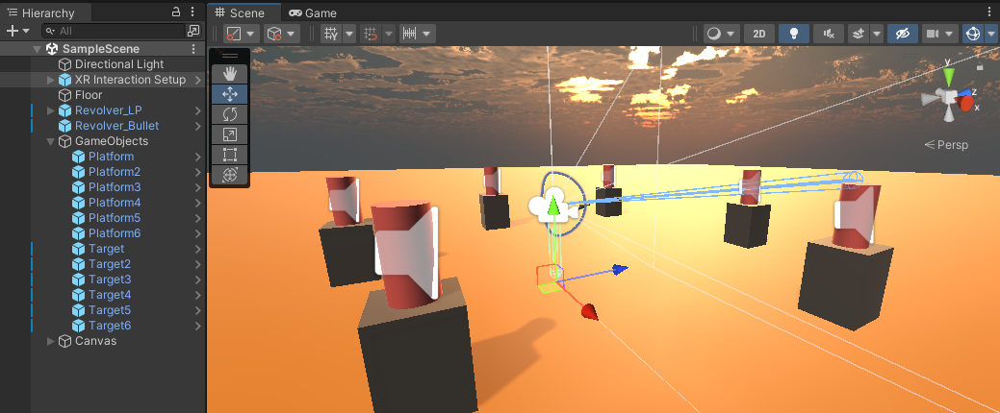
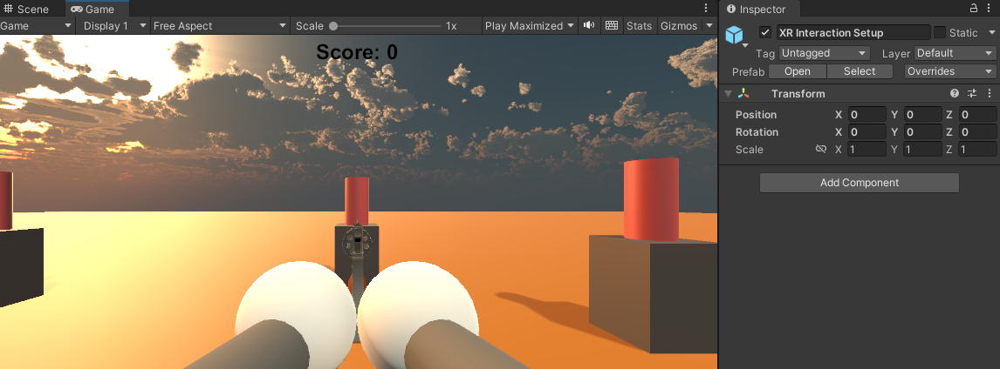

# **VR Target Shooting Game**

### **Introduction**
This is a simple **VR Target Shooting Game** developed in Unity using the **XR Interaction Toolkit**. The game allows the player to grab a revolver, shoot bullets, and hit targets placed in the scene. Features like sound effects and a scoring system are included to improve the gameplay experience.

### **Features**
- **Grab and Shoot**: Players can grab a revolver and shoot bullets.
- **Targets**: Cylindrical targets react when hit by bullets.
- **Scoring System**: The score increments with each successful hit, displayed on the screen.
- **Sound Effects**: Audio is played when targets are hit.
- **Lighting and Shadows**: Configured for a better visual experience.

### **Steps**

#### **1. Set Up Unity Project and VR Environment**
- Created a new 3D project in Unity.
- Installed the **XR Interaction Toolkit** and configured the project for VR.
- Added **XR Device Simulator** and a **ground plane** for movement.

#### **2. Create a Ground Plane and Add a Skybox**
- Added a ground plane and downloaded a **Skybox** from Unity Asset Store for the environment.

#### **3. Add Environment Objects**
- Imported a gun and bullet prefabs from the Asset Store.
- Added colliders to the gun and bullets for interaction.

#### **4. Configure Lighting and Shadows**
- Adjusted **Directional Light** and enabled **Soft Shadows** for better visuals.

#### **5. Add Audio**
- Added audio sources to targets for playing sounds when hit.

#### **6. Implement Basic VR Interaction**
- Created a **GunShooting** script to shoot bullets from the revolver using the left mouse button.

#### **7. Write the VR Interaction Script**
- Added a **TargetInteraction** script to handle collisions between bullets and targets. The target gets destroyed, and a sound is played when hit.

#### **8. Add Scoring Mechanism**
- Added a **UI Text** to display the score and updated the interaction script to increment the score with each hit.

### **Screenshots**
#### **Scene View**


#### **In-Game View**


### **Steps to Run the Game**

1. **Clone the Repo**:
   ```bash
   git clone https://github.com/your-username/your-repo-name.git
2. **Open in Unity**:
Open Unity Hub, click Add, and select the cloned project folder.

3. **Install Packages**:
Ensure XR Interaction Toolkit and XR Plugin Management are installed via Window > Package Manager.

4. **Play the Game**:
Press Play in the Unity Editor and use the XR Device Simulator to move (WASD) and shoot (left-click).

5. **Build the Game (Optional)**:
Go to File > Build Settings, select your platform, and click Build.
